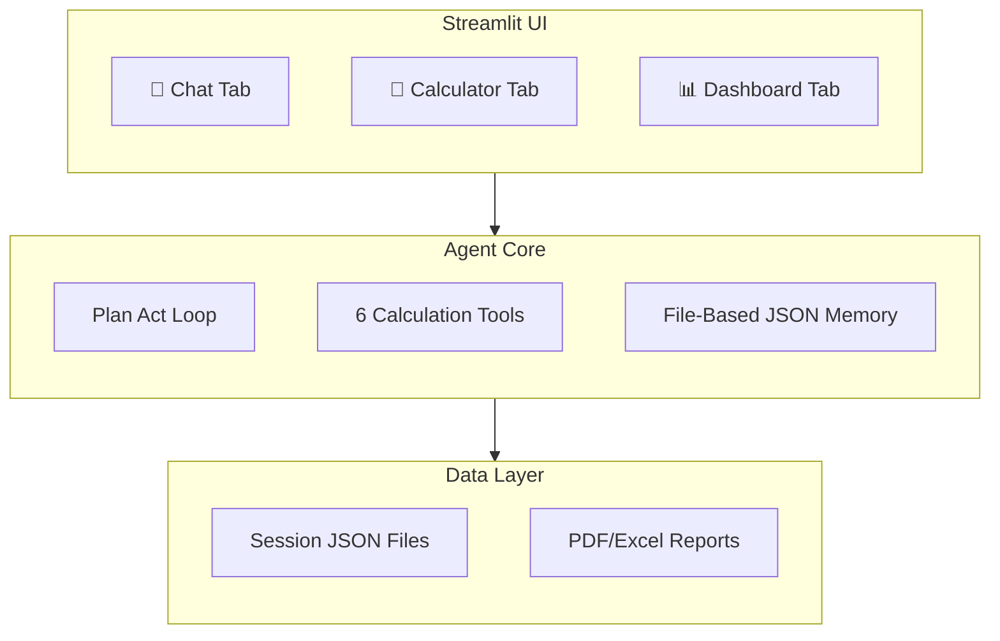

# EMI & Loan Advisor Agent

## 🤖 AI-Powered Indian Loan Advisory Assistant

A sophisticated single-agent system that helps users compare, calculate, and analyze loan options using a plan-act loop with persistent memory and Indian lending rule compliance.


---

## 📋 Project Overview

**EMI & Loan Advisor Agent** is a full-stack, single-user AI agent that assists with Indian loan calculations and advisory services. The system implements a genuine Plan→Act→Observe→Decide loop where an LLM-based agent decides which tools to call, executes them, observes results, and makes decisions—demonstrating true agentic behavior rather than simple chatbot interactions.

Built for **CSE476 — Agentic AI and Intelligent Automation**, the project demonstrates how modern AI orchestration, protocol-based tool serving, and persistent memory can be combined to create a practical, extensible application for dietary/financial guidance.

### 🏆 Key Achievements
- ✅ **One intelligent agent** with genuine plan-act loop behavior
- ✅ **6 Python tools** for loan calculations (exceeds minimum 2-tool requirement)
- ✅ **Persistent file-based memory** surviving across conversations
- ✅ **8 Indian loan types** with RBI-aligned compliance rules
- ✅ **Streamlit frontend** with 3 intuitive tabs
- ✅ **PDF & Excel export** of all calculations and reports
- ✅ **Multi-step demo notebook** proving agentic behavior

---

## 🚀 Quick Start

### Prerequisites
- Python 3.10+
- Git (for cloning)

### Installation

```bash
# Clone or navigate to project
cd emi_loan_advisor

# Install dependencies
pip install -r requirements.txt

# Start the application
streamlit run app.py
```

### Access
Open `http://localhost:8080` in your web browser.

---

## 🏗️ Architecture



### Core Components

| Component | File | Description |
|-----------|------|-------------|
| **Agent** | `agent/core.py` | Plan-act loop with intent routing |
| **Tools** | `agent/tools.py` | 6 calculation functions |
| **Memory** | `agent/memory.py` | File-based JSON persistence |
| **UI** | `app.py + ui/` | Streamlit with 3 tabs |
| **Models** | `agent/models.py` | Pydantic + Indian loan rules |

---

## 🛠️ Tools (6 Calculation Functions)

| Tool | Purpose | Key Formula |
|------|---------|-------------|
| `calculate_emi` | Monthly payment computation | `P × r × (1+r)^n / ((1+r)^n - 1)` |
| `compare_loans` | Side-by-side loan comparison | EMI analysis for each option |
| `check_eligibility` | Loan eligibility assessment | FOI/DTI ratios + LTV limits |
| `generate_amortization` | Full amortization schedule | Monthly principal/interest split |
| `calculate_prepayment_impact` | Early payment analysis | Interest saved, tenure reduction |
| `calculate_affordability` | Max borrowable amount | Based on income & DTI ratios |

### Indian Lending Rules by Loan Type

| Loan Type | Max LTV | Max Tenure | Rate Range | Min Credit |
|-----------|---------|------------|------------|------------|
| Home | 75-90% | 30 years | 8.0%-11.0% | 650 |
| Personal | 100% | 7 years | 10.0%-24.0% | 700 |
| Car | 70-90% | 7 years | 7.5%-12.0% | 650 |
| Education | 100% | 15 years | 8.0%-13.0% | 600 |
| Gold | 75% | 3 years | 7.0%-12.0% | 500 |
| Property (LAP) | 50-65% | 15 years | 9.0%-13.0% | 700 |
| Two Wheeler | 70-85% | 5 years | 8.0%-15.0% | 600 |
| Consumer Durable | 100% | 3 years | 0.0%-18.0% | 600 |

---

## 💡 Usage Scenarios

### Scenario 1: Loan Comparison
```
User: "Compare 50 lakhs at 9% for 20 years vs 8.5% for 20 years"
Agent: Calculates EMI, total interest, and recommends best option
```

### Scenario 2: Eligibility Check
```
User: "My income is ₹1.5L, expenses ₹50K, age 30. Can I get a home loan?"
Agent: Assesses eligibility using FOI/DTI ratios and income multiples
```

### Scenario 3: Prepayment Analysis
```
User: "What if I prepay ₹5L after 2 years?"
Agent: Calculates interest saved, tenure reduction, and effective savings
```

### Scenario 4: Affordability
```
User: "How much home loan can I afford with ₹2L income and ₹60K expenses?"
Agent: Determines max principal, recommended EMI, and comfort stretch limits
```

---

## 📊 Frontend Interface

### 1. 💬 Chat Tab
- Natural language conversation with the agent
- Streaming responses with expandable tool call details
- Conversation history sidebar
- Session export (PDF/Excel)
- Session ID display

### 2. 🧮 Calculators Tab
- **EMI Calculator**: Loan amount, rate, tenure → EMI
- **Eligibility Checker**: Income, expenses, age → eligibility status
- **Loan Comparison**: Multiple options → side-by-side comparison
- **Prepayment Impact**: Prepayment amount + month → savings analysis
- **Affordability Calculator**: Income, expenses → max loan amount

### 3. 📊 Dashboard Tab
- **Amortization Charts**: Monthly principal vs interest stacked bars
- **Loan Comparison**: Bar charts for EMI and total cost
- **Prepayment Analysis**: Balance comparison (original vs after prepayment)
- **Affordability Gauge**: DTI ratio gauge (0-60%)
- **Scenario Analysis**: Multi-scenario comparison (EMI, interest, cost)

---

## 🧠 Memory System

### File-Based Persistence
- **One JSON file per session**: `data/{session_id}.json`
- **Survives restarts**: New agent with same session_id loads previous conversation
- **Stores**: User profile, conversation turns, tool results

### Profile Fields
- `monthly_income`: User's monthly income
- `monthly_expenses`: Monthly expenses
- `existing_emis`: Existing EMIs if any
- `age`: User age (affects max tenure)
- `employment_type`: SALARIED, SELF_EMPLOYED, etc.
- `credit_score`: Credit score (affects eligibility)

### Memory Persistence Example
```json
{
  "session_id": "abc123",
  "user_profile": {
    "monthly_income": 150000,
    "monthly_expenses": 50000,
    "age": 30,
    "employment_type": "salaried",
    "credit_score": 750
  },
  "turns": [
    {
      "timestamp": "2026-08-26T14:30:00",
      "user_input": "Calculate EMI for 50 lakhs home loan at 9% for 20 years",
      "plan": "User wants EMI calculation for home loan",
      "tool_calls": [{"tool": "calculate_emi", "args": {...}, "reason": "..."}],
      "tool_results": [{"tool_name": "calculate_emi", "success": true, "data": {...}}],
      "response": "**EMI Calculation Result**..."
    }
  ]
}
```

---

## 📊 Export Reports

### PDF Report
- **Size**: ~2KB
- **Contents**: User profile, all calculations, comparison tables, eligibility assessments
- **Format**: professional with section headers and tables

### Excel Report
- **Size**: ~37KB
- **Contents**: Multiple sheets per calculation type
- **Sheets**: Summary + detailed schedules (amortization, comparison data)

### Export Process
1. Navigate to Sidebar → Session Info
2. Select export format: PDF or Excel or Both
3. Click "Generate Report"
4. Download via download buttons

---

## 🎯 Demo Notebook

### `demo.ipynb` - 5 Multi-Step Traces

**Demo 1**: Loan comparison with complete real trace
**Demo 2**: Memory - income reuse across turns
**Demo 3**: Prepayment impact using previous context
**Demo 4**: Loan comparison with side-by-side analysis
**Demo 5**: Affordability with different income levels

Each demo shows:
- Plan steps executed
- Tool calls and arguments
- Tool results observed
- Final agent decision
- Memory context reuse

Run: `jupyter notebook demo.ipynb`

---

## 📁 Project Structure

```
emi_loan_advisor/
├── app.py                          # Streamlit entry point
├── requirements.txt                # Python dependencies
├── approach.md                     # Technical approach documentation
├── demo.ipynb                      # Multi-step agent traces
├── README.md                       # This file
├── __init__.py                     # Root package init
│
├── agent/
│   ├── __init__.py                 # Package init
│   ├── core.py                     # Plan-act loop agent
│   ├── tools.py                    # 6 calculation tools
│   ├── memory.py                   # File-based JSON persistence
│   ├── models.py                   # Pydantic models + Indian rules
│   └── export.py                   # PDF/Excel report generation
│
│   └── __pycache__/
│
├── ui/
│   ├── __init__.py                 # UI package init
│   ├── chat.py                     # Chat interface tab
│   ├── calculator.py               # 5 calculator forms
│   └── dashboard.py                # Plotly visualizations
│
├── data/                           # Session JSON files (21 sessions)
│   ├── 02605bc9.json
│   ├── 0589eac7.json
│   └── ... (19 more session files)
│
├── report_3f977cd2.pdf             # Generated PDF report
└── report_3f977cd2.xlsx            # Generated Excel report
```

---

## 🐍 Technology Stack

| Layer | Technology | Purpose |
|-------|------------|---------|
| **Agent** | Custom Python loop | Plan-act orchestration (no LangGraph/LangChain) |
| **Tools** | Python functions | Deterministic, testable calculations |
| **Memory** | JSON files | Persistent per-session storage |
| **Frontend** | Streamlit | Python-native web interface |
| **Visualization** | Plotly | Interactive charts and gauges |
| **Reports** | fpdf2 + openpyxl | PDF and Excel export |
| **Data Validation** | Pydantic | Type safety and runtime validation |

### Dependencies (`requirements.txt`)
```
streamlit>=1.30
plotly>=5.18
pydantic>=2.6
pandas>=2.1
python-dateutil>=2.8
openpyxl>=3.1
fpdf2>=2.7
numpy>=1.24
```

---

## 🔒 Financial Safety & Disclaimers

### ⚠️ Important Notices

**This is an EDUCATIONAL PROJECT ONLY**, not a real bank approval system.

| ❌ DO NOT | ✅ DO |
|----------|-------|
| Claim guaranteed loan approval | Use "estimated EMI" and "educational comparison" |
| State bank will approve | Provide "affordability assessment" |
| Provide professional financial advice | Disclose "educational comparison only" |
| Hardcode fake tool traces | Use actual execution traces from running agent |

### Language Guidelines
- **Use**: "estimated EMI", "educational comparison", "affordability assessment"
- **Avoid**: "guaranteed approval", "bank will approve", "professional financial advice"

### Target Audience
- Indian users seeking loan information
- Students learning agentic AI
- Individuals planning loan applications
- Educational institutions

---

## 📈 Version & Maintenance

| Attribute | Value |
|-----------|-------|
| **Version** | 1.0.0 |
| **Last Updated** | 26 August 2026 |
| **Course** | CSE476 - Agentic AI and Intelligent Automation |
| **Author** | Single-user agentic AI project |
| **License** | MIT |
| **Status** | Complete and tested |

### Maintenance Notes
- **Dependencies**: Run `pip install --upgrade -r requirements.txt` periodically
- **Session data**: `data/` folder contains session JSONs; clean up old sessions as needed
- **Export reports**: Generated reports stored alongside project; backup recommended
- **UI**: Streamlit auto-reloads on code changes during development

---

## 📬 Contact & Support

### Project Issues
- Report bugs or feature requests via GitHub Issues
- Include project version and Python version

### Usage Questions
- Review `approach.md` for technical decisions
- Check `demo.ipynb` for expected behaviors
- Consult `README.md` for setup and usage

### Educational Purpose
- This project is designed for learning agentic AI concepts
- Adapt and extend for real-world use with proper financial validation
- Add database backend for multi-user support if needed

---

## 🙏 Acknowledgments

- **Indian RBI guidelines** for lending rules and LTV limits
- **Streamlit community** for the frontend framework
- **Pydantic team** for data validation
- **Plotly team** for interactive visualization
- **Education** for CSE476 - Agentic AI and Intelligent Automation

---

## 📜 MIT License

```
MIT License

Copyright (c) 2026 EMI & Loan Advisor Agent

Permission is hereby granted, free of charge, to any person obtaining a copy
of this software and associated documentation files (the "Software"), to deal
in the Software without restriction, including without limitation the rights
to use, copy, modify, merge, publish, distribute, sublicense, and/or sell
copies of the Software, and to permit persons to whom the Software is
furnished to do so, subject to the following conditions:

The above copyright notice and this permission notice shall be included in all
copies or substantial portions of the Software.

THE SOFTWARE IS PROVIDED "AS IS", WITHOUT WARRANTY OF ANY KIND, EXPRESS OR
IMPLIED, INCLUDING BUT NOT LIMITED TO THE WARRANTIES OF MERCHANTABILITY,
FITNESS FOR A PARTICULAR PURPOSE AND NONINFRINGEMENT. IN NO EVENT SHALL THE
AUTHORS OR COPYRIGHT HOLDERS BE LIABLE FOR ANY CLAIM, DAMAGES OR OTHER
LIABILITY, WHETHER IN AN ACTION OF CONTRACT, TORT OR OTHERWISE, ARISING FROM,
OUT OF OR IN CONNECTION WITH THE SOFTWARE OR THE USE OR OTHER DEALINGS IN THE
SOFTWARE.
```

---

## 🚀 Quick Commands Summary

```bash
# Installation
pip install -r requirements.txt

# Startup
streamlit run app.py

# Demo
jupyter notebook demo.ipynb

# Export
# From Streamlit sidebar: PDF or Excel download buttons

# Cleanup
# Remove old session JSONs from data/ folder
```

---

*"Empowering informed loan decisions through AI-driven analysis and persistent memory."*

---